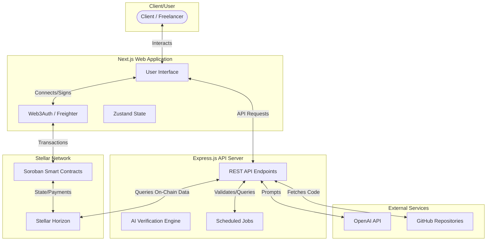

# AgenticPay Architecture Documentation

This document provides a high-level overview of the AgenticPay architecture, designed to help new developers understand the system's components, data flow, and technology stack.

## System Diagram

## Component Descriptions

AgenticPay is composed of three main architectural pillars:

### 1. Frontend Web Application
The user-facing application built with Next.js. It serves as the primary gateway for clients to create projects and freelancers to submit their work.
- **Web3 Integration**: Facilitates connection to the Stellar network using Freighter wallet and supports social login via Web3Auth.
- **State Management**: Uses Zustand for client-side state handling.
- **UI Components**: Built with React, Tailwind CSS, shadcn/ui, and Framer Motion for responsive and animated user interfaces.

### 2. Backend API Server
An Express.js REST API server that acts as the off-chain processing engine for AgenticPay.
- **AI Work Verification**: The core feature that validates freelancer code submissions (e.g., GitHub repositories) against the initial project requirements using OpenAI.
- **Bulk Operations and Invoicing**: Manages batch verifications and automatically generates invoices for completed projects.
- **Scheduled Jobs**: Runs background tasks for system maintenance and monitoring of on-chain states via the Stellar Horizon API.

### 3. Smart Contracts (Soroban)
Rust-based smart contracts deployed on the Stellar network to handle trustless and decentralized operations.
- **Escrow Management**: Securely locks client funds (XLM and other Stellar tokens) when a project is initiated.
- **Work Approval & Payouts**: Facilitates the release of funds directly to the freelancer upon successful work verification.
- **Dispute Resolution**: On-chain logic to manage and arbitrate potential disputes between clients and freelancers.

## Data Flow

The typical lifecycle of a project on AgenticPay follows this data flow:

1. **Project Initiation**:
   - A Client logs into the Frontend and creates a new project with specific requirements.
   - The Client deposits the required funds. The Frontend pushes a transaction to the Soroban Smart Contract, locking the funds in escrow.
2. **Work Submission**:
   - A Freelancer accepts the project and begins work.
   - Upon completion, the Freelancer submits the work deliverables (e.g., a GitHub repository link) via the Frontend.
3. **AI Verification**:
   - The Frontend sends the submission details to the Backend API.
   - The Backend fetches the code from the provided link and uses the OpenAI API to evaluate the deliverables against the original project requirements.
   - The Backend returns a verification status (Approved, Rejected, or Needs Revision).
4. **Payout / Release**:
   - Once the work is successfully approved (either automatically via AI or manually by the client), a release transaction is signed and submitted to the Soroban Smart Contract.
   - The Smart Contract transfers the escrowed funds directly to the Freelancer's wallet on the Stellar network.

## Technology Stack

### Frontend
- **Framework**: Next.js, React
- **Language**: TypeScript
- **Styling**: Tailwind CSS, shadcn/ui, Framer Motion
- **State Management**: Zustand
- **Web3/Blockchain**: Stellar SDK, Freighter Wallet, Web3Auth (Social Login)

### Backend
- **Framework**: Node.js, Express.js
- **Language**: TypeScript
- **AI Integration**: OpenAI API
- **Blockchain Integration**: Stellar Horizon SDK
- **Task Scheduling**: Scheduled Jobs internally managed

### Smart Contracts
- **Language**: Rust
- **Environment**: Soroban SDK
- **Network**: Stellar Testnet / Public Network
